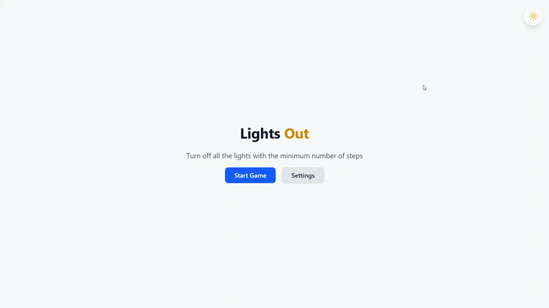
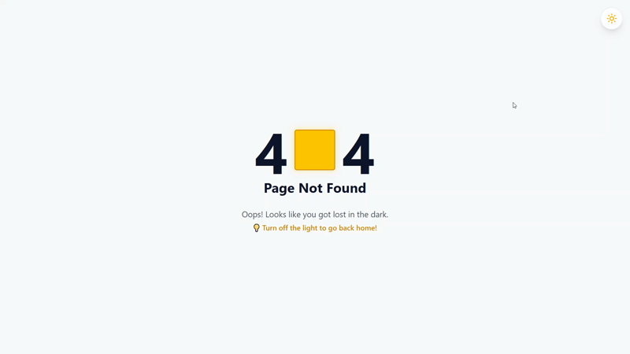

# 💡 Lights Out Game

[](https://github.com/makrdzr/lights-out/actions/workflows/ci.yml)
[](./LICENSE)

Logic puzzle game "Lights Out".
Implemented on React + TypeScript + Vite.

---

### 🔗 [🕹 LIVE DEMO](https://makrdzr.github.io/lights-out/)

---

## 🎬 Gameplay Demo

<div align="center">
  
</div>

---

## 🎮 Game Rules

The game consists of a grid of lights that can be switched on or off.

- **Interaction:** Clicking on a cell toggles its state and the state of its adjacent neighbors (top, bottom, left, right).
- **Goal:** Turn off all the lights on the grid.
- **Challenge:** Try to achieve this in the minimum number of steps!

---

## 🗝 Key Features

- 🛠 **Customizable Grid:** Choose grid sizes from 4x4 up to 8x8.
- 🌓 **Theme Support:** Dark and Light mode support with system sync.
- 💾 **Persistence:** Game state, settings, and personal bests are saved using Zustand `persist`.
- 📱 **PWA Support:** Fully installable as a Progressive Web App for offline play.
- 🚀 **Robust Routing:** Custom 404 Error Page and smooth navigation transitions.
- ⚡ **Modern Stack:** Built with React 19, Tailwind CSS v4, and Vite.

---

## 📸 UI/UX & Routing

To ensure a professional feel, the application features a custom 404 page where users can seamlessly navigate back to the game by turning off the flashlight (the '0' in '404').

<div align="center">
  
</div>

---

## 🛠 Technology stack

- **Core:** React, TypeScript, Vite
- **Styles:** Tailwind CSS
- **Forms:** React Hook Form + Zod
- **Routing:** React Router
- **State Management:** Zustand
- **Testing:** Jest, React Testing Library
- **Containerization:** Docker, Docker Compose
- **CI/CD:** GitHub Actions

---

## 🚀 How to launch a project

### Without Docker (requires Node.js)

1. **Clone the repository**

   ```bash
   git clone <repository-url>
   cd lights-out
   ```

2. **Install dependencies**

   ```bash
   npm install
   ```

3. **Start the project**

   ```bash
   npm run dev
   ```

### With Docker (requires only Docker)

1. **Clone the repository**

   ```bash
   git clone <repository-url>
   cd lights-out
   ```

2. **Start development server**

   ```bash
   docker compose up -d dev
   ```

App will be available at [http://localhost:5173/lights-out/](http://localhost:5173/lights-out/)

3. **Run npm commands inside the container**

   ```bash
   docker compose exec dev npm run tidy
   docker compose exec dev npm run test
   ```

4. **Preview production build locally**

   ```bash
   docker compose --profile prod up -d prod
   ```

5. **Rebuild after code changes**

   ```bash
   docker compose --profile prod up -d prod --build
   ```

App will be available at [http://localhost:80/lights-out/](http://localhost:80/lights-out/)

---

## ✨ Implemented best practices

1. **Component-Based Architecture**
   - **Description:** The project follows a clear, modular structure by separating UI into distinct component categories: pages, layouts, and reusable UI/game components. This enhances maintainability and scalability.
   - **Evidence:** `src/pages/GamePage.tsx`, `src/layouts/ContainerLayout.tsx`, `src/components/ui/Button.tsx`, `src/components/game/GameGrid.tsx`.

2. **Code Quality & Consistency with ESLint and Prettier**
   - **Description:** The project enforces code quality and consistent formatting using ESLint for linting and Prettier for code formatting. This ensures a uniform codebase and helps prevent common errors.
   - **Evidence:** `eslint.config.js`, `.prettierrc`, `.prettierignore`, `package.json` (for scripts).

3. **Advanced State Management & Persistence with Zustand**
   - **Description:** Global state is managed using Zustand with its `persist` middleware. This implementation ensures that game settings, player history, and active game sessions are preserved across page reloads, providing a seamless user experience.
   - **Features:**
     - **Session Recovery:** Active games (grid state, steps, timer) are saved in real-time, allowing players to resume exactly where they left off.
     - **Game History:** Persistent log of the last 10 games played.
     - **Personal Bests:** Tracks the minimum steps taken to win for each grid size.
   - **Evidence:** `src/store/settings.ts`, `src/store/results.ts`, and `src/store/game.ts`.

4. **Strong Typing with TypeScript**
   - **Description:** The entire codebase is written in TypeScript, providing type safety that prevents common bugs, improves code completion, and makes the code self-documenting.
   - **Evidence:** All `.ts` and `.tsx` files in the project, such as `src/types/settings.ts` and component prop definitions.

5. **Declarative Routing**
   - **Description:** The application uses React Router to declaratively define its pages and navigation flow, making the application structure easy to understand and manage.
   - **Evidence:** The routing configuration is defined in `src/router/index.tsx`.

6. **PWA & Mobile-First Experience**
   - **Description:** The application is designed to feel like a native mobile app and is a fully functional Progressive Web App (PWA) with offline capabilities.
   - **Features:**
     - **Offline Support:** Using Service Workers (via `vite-plugin-pwa`), the game can be played without an internet connection once loaded.
     - **"Add to Home Screen":** Complete set of icons and a web manifest allow users to install the game on their devices.
     - **Responsive Layout:** The grid and UI components are fluidly scaled to fit any screen size (from 320px up), using CSS Grid and `aspect-square` for consistent cell rendering.
   - **Evidence:** `vite.config.ts`, `src/main.tsx`, `public/favicon/`, and `index.html`.

7. **Testing**
   - **Description:** The project includes unit and component tests written with Jest and React Testing Library, covering core game logic, Zustand stores, and UI components.
   - **Evidence:** `src/hooks/__tests__/`, `src/store/__tests__/`, `src/components/**/__tests__/`.

8. **Containerization with Docker**
   - **Description:** The project includes a multi-stage Dockerfile and Docker Compose configuration, allowing development and production environments to run without installing Node.js locally.
   - **Features:**
     - **Dev container:** Vite dev server with hot reload and volume mounting for live code updates.
     - **Prod container:** Optimized production build served via Nginx.
   - **Evidence:** `Dockerfile`, `compose.yaml`, `nginx.conf`, `.dockerignore`.

9. **CI/CD with GitHub Actions**
   - **Description:** The project includes automated workflows for continuous integration and deployment using GitHub Actions with a reusable composite action for Node.js setup.
   - **Features:**
     - **CI:** Runs on every push and pull request — checks formatting, linting, tests, and build. Deploy job is blocked until all checks pass.
     - **Deploy:** Automatically deploys to GitHub Pages on every push to `main`.
     - **Reusable action:** Node.js setup and dependency installation are extracted into `.github/actions/setup-node` to avoid duplication.
   - **Evidence:** `.github/workflows/ci.yml`, `.github/workflows/deploy.yml`, `.github/actions/setup-node/action.yml`.

10. **Separation of Concerns**
    - **Description:** Core game mechanics — including solvability-guaranteed grid generation, neighbor coordinate calculations, and move validation — are decoupled from UI components. This is achieved through the custom `useGameLogic` hook, which manages the application's complex state transitions.
    - **Features:**
      - **Thin Components:** UI components like `GameGrid` and `Cell` remain declarative and focused solely on presentation.
      - **Testability:** Business logic is isolated and independently testable via unit tests.
      - **Maintainability:** Changes to game rules can be implemented in a single place without affecting UI rendering.
    - **Evidence:** `src/hooks/useGameLogic.ts`, `src/components/game/GameGrid.tsx`, `src/hooks/__tests__/useGameLogic.test.ts`.
